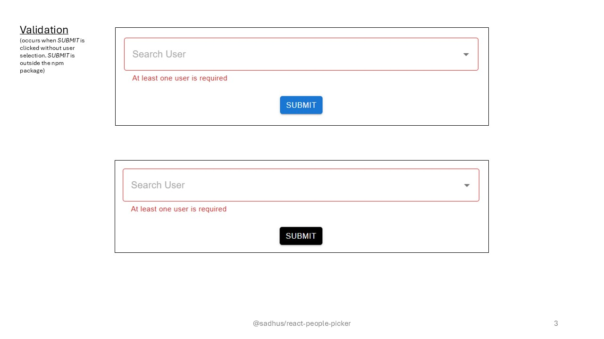

# React People Picker

A versatile and customizable React People Picker component built with Material-UI, featuring search, debounce, and multi-selection capabilities.

## ✨ Features

* **Material-UI Integration:** Seamlessly integrates with your Material-UI themed applications.
* **Search Functionality:** Filter available options by typing in the input field.
* **Debounced Search:** Optimizes performance by delaying search queries, reducing unnecessary API calls or list filtering.
* **Customizable Options:** Easily provide your own list of people.
* **Controlled Component:** Manage selected values from parent component state.
* **Clear Selection:** Option to clear all selected items.

## Screenshots




## 🚀 Installation

First, install the package in your React project:

```bash
npm install @sadhus/react-people-picker
  or
yarn add @sadhus/react-people-picker
```

This component relies on <mark>react</mark>, <mark>react-dom</mark>, <mark>@mui/material</mark>, <mark>@mui/icons-material</mark>, <mark>@emotion/react</mark>, and <mark>@emotion/styled</mark> as peer dependencies. Ensure these are also installed in your project:

```bash
npm install react react-dom @mui/material @mui/icons-material @emotion/react @emotion/styled
  or
yarn add react react-dom @mui/material @mui/icons-material @emotion/react @emotion/styled
```

## 💡 Usage

```bash
import React, { useState } from 'react';
import { Box, Button } from '@mui/material';
import PeoplePicker from "@sadhus/react-people-picker";


// Mock API call in the CONSUMING APPLICATION
const mockUsersApiCall = (searchTerm) => {
  console.log('Consumer App: API Call for search:', searchTerm);
  const allUsers = [
    { id: '1', name: 'Alice Smith', email: 'alice@example.com', alias: 'alismi' },
    { id: '2', name: 'Bob Johnson', email: 'bob@example.com', alias: 'bobjoh' },
    { id: '3', name: 'Charlie Brown', email: 'charlie@example.com', alias: 'chabro' },
    { id: '4', name: 'Diana Prince', email: 'diana@example.com', alias: 'diapri' },
    { id: '5', name: 'Eve Adams', email: 'eve@example.com', alias: 'evedam' },
  ];

  return new Promise((resolve) => {
    setTimeout(() => {
      const lowercasedQuery = searchTerm.toLowerCase();
      const filtered = allUsers.filter(user =>
        user.name.toLowerCase().includes(lowercasedQuery) ||
        user.email.toLowerCase().includes(lowercasedQuery) ||
        (user.alias && user.alias.toLowerCase().includes(lowercasedQuery)) 
      );
      resolve(filtered);
    }, 300);
  });
};


function App() {
  const [selectedUsers, setSelectedUsers] = useState([]);
  const [formSubmitted, setFormSubmitted] = useState(false);

const handleSubmit = () => {
    setFormSubmitted(true); // Trigger validation
    
    // do respective form submission logic here
  };

  return (
    <div className="App">
      <PeoplePicker
        maxWidth="400px"
        autocompleteBordercolor="dimgray"
        chipColor="dimgray"
        tooltipColor="darkgray"
        placeholder="Search user by name/email/alias"
        debounceDelay={300}
        minSearchLength={3}
        initialSelectedUsers={[]}
        onSearch={mockUsersApiCall}
        onSelectedUsersChange={setSelectedUsers}
        isRequired={true}
        requiredErrorMessage="At least one user is required"
        isError={formSubmitted && selectedUsers.length === 0}
      />

      <Box sx={{ display: "flex", justifyContent: "center", mt: 2 }}>
        <Button
          variant="contained"
          onClick={handleSubmit}
          size="small"
          sx={{ backgroundColor: "black", color: "white" }}
        >
          submit
        </Button>
      </Box>
    </div>
  );
}

export default App;
```

## ⚙️ Props

```

```

| Prop Name       | Type                                                | Default                             | Description                                     |
| :------------   | :-----------                                        | :--------------------------------   | :-------------------------------------------    |
| initialSelectedUsers | Array<{id: string, name: string, email?: string}>   | []                                  | An array of initial selected people objects. Each object should at least have `id` and `name`.   |
| onSearch     | (searchTerm: string)  => Promise<Array<{id: string, name: string, email?: string}>> | undefined | A function that receives the search term and should return a Promise resolving to an array of people objects. This is where your API call or data filtering logic goes. |
| onSelectedUsersChange | (selected: Array<{id: string, name: string, email?: string}>) => void | undefined | Callback function triggered when the selection changes, receiving the updated array of selected people. |
| debounceDelay | number  | 300 | The time in milliseconds to debounce the `onSearch` function calls. |
| minSearchLength | number  | 3 | Minumum character length needed for a search to trigger. |
| maxWidth  | number  | 600px | Maximum width of the control.  |
| autocompleteBordercolor | string  | theme.palette.primary.dark  | border color of the autocomplete control.  |
| chipColor | string  | theme.palette.primary.dark  | fill color of the chip holding the user name in the autocomplete control.  |
| tooltipColor  | string  | theme.palette.primary.light | color of the tooltip when the cursor is hovered on the chip.  |
| placeholder     | string  | 'Search User' | The placeholder text for the input field. |
| isRequired  | boolean | false | If the control mandatory in the form.  |
| requiredErrorMessage  | string  | null  | This field is mandatory when `isRequired` field is part of the control. |

## 🛠️ Development
To set up the development environment for this component library:

1. Clone the repository:
``` 
git clone [https://github.com/adityasrk/react-people-picker.git](https://github.com/adityasrk/react-people-picker.git)
cd my-people-picker-library
```
2. Install dependencies:
```
npm install or yarn install
```
3. Run the Rollup build in watch mode (optional, for library development):
```
npm run dev
```
This will recompile your library files (`dist/`) automatically on changes.

4. Run the demo application:

In a separate terminal, navigate to the `demo-app` directory and start the CRA development server:
```
cd demo-app
npm install # Only if not done during the main 'npm install' or 'yarn install' at root
npm start
```
This will open the demo application in your browser, where you can test the PeoplePicker component.

## Color Reference

| Color         | Hex           |
| :------------ | :---------    |
| theme.palette.primary.dark |  #1565c0    |
| theme.palette.primary.light |  #42a5f5    |
| dimgray |  #696969    |
| darkgray |  #A9A9A9    |

##  🤝 Contributing
Contributions are welcome! Please feel free to open an issue or submit a pull request.

##  📄 License
This project is licensed under the MIT License. See the `LICENSE` file for details.


